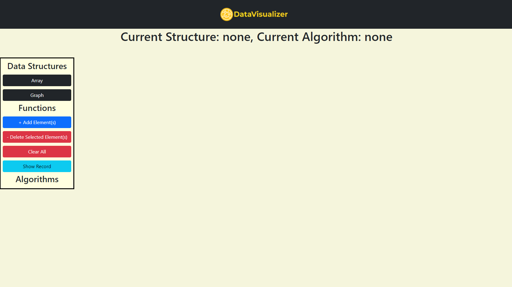
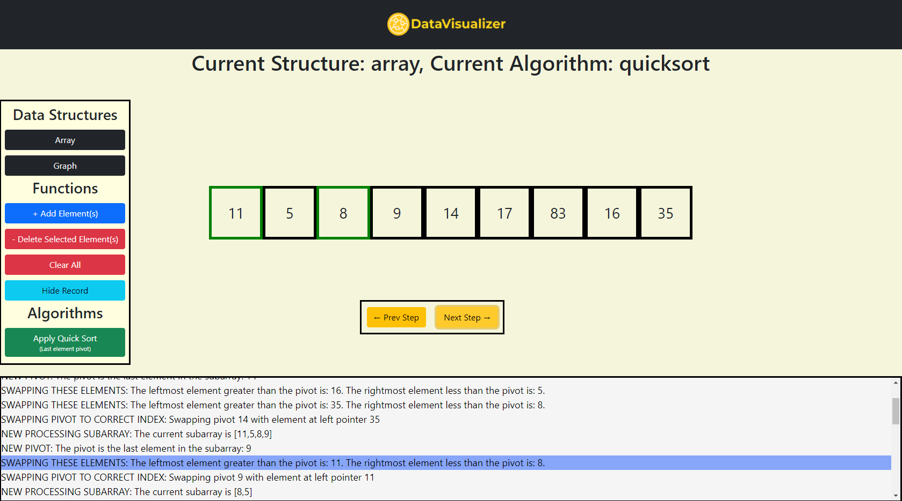
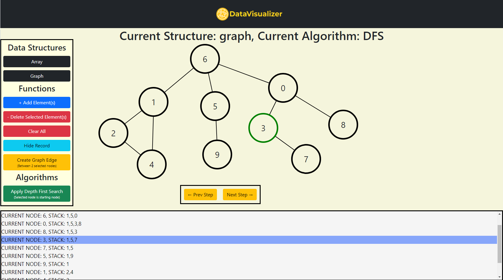
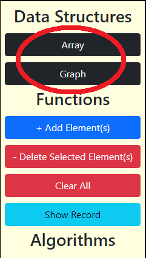
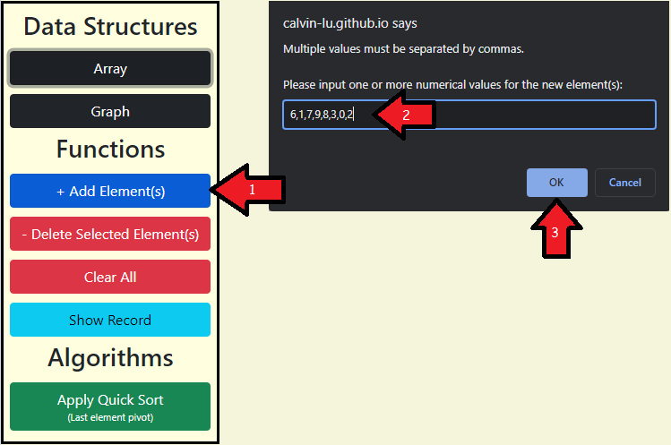
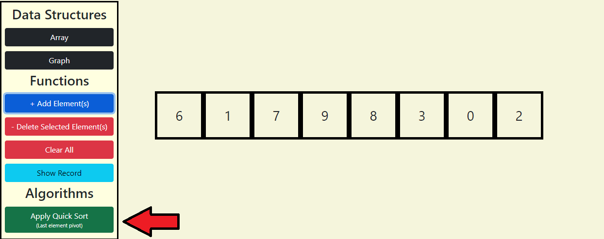
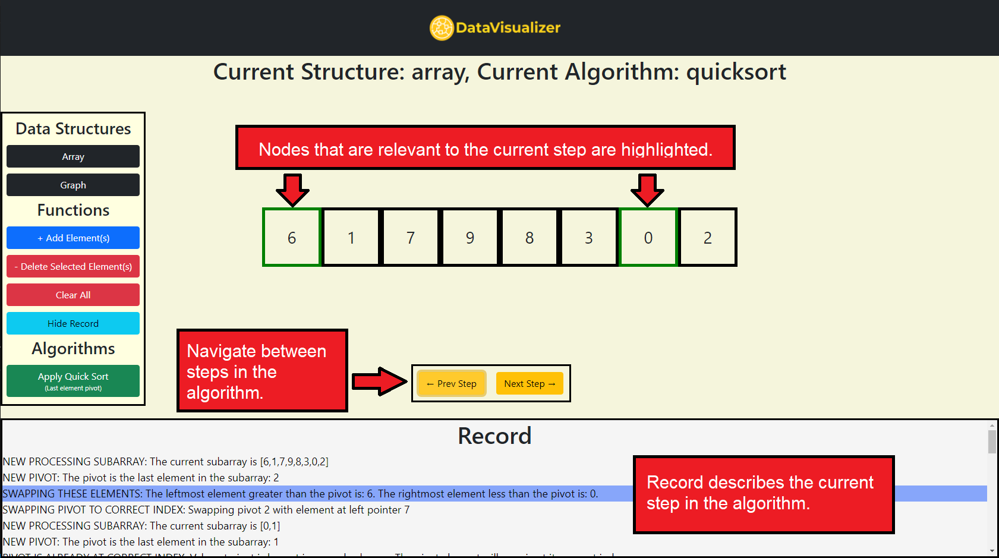

# Data Visualizer

Web application built with React that visualizes common data structures, with support for descriptive step-by-step executions of well known algorithms. 

Currently available at: https://calvin-lu.github.io/data-visualizer/

# Site

## Landing Page

## Array Quick Sort Example

## Graph DFS Example

# HOW TO USE

### 1. Select a data structure upon opening the web page.
 
  
### 2. Add elements to populate the data structure with data.

### 3. Select any available algorithm. Some algorithms will require some nodes to be selected before they can be initialized.

### 4. Navigate through the algorithm's execution.

# TODO
<ul> 
  <li> Implement more array and graph algorithms </li>
  <li> Autoscroll Record when offscreen entries are selected</li>
</ul>
